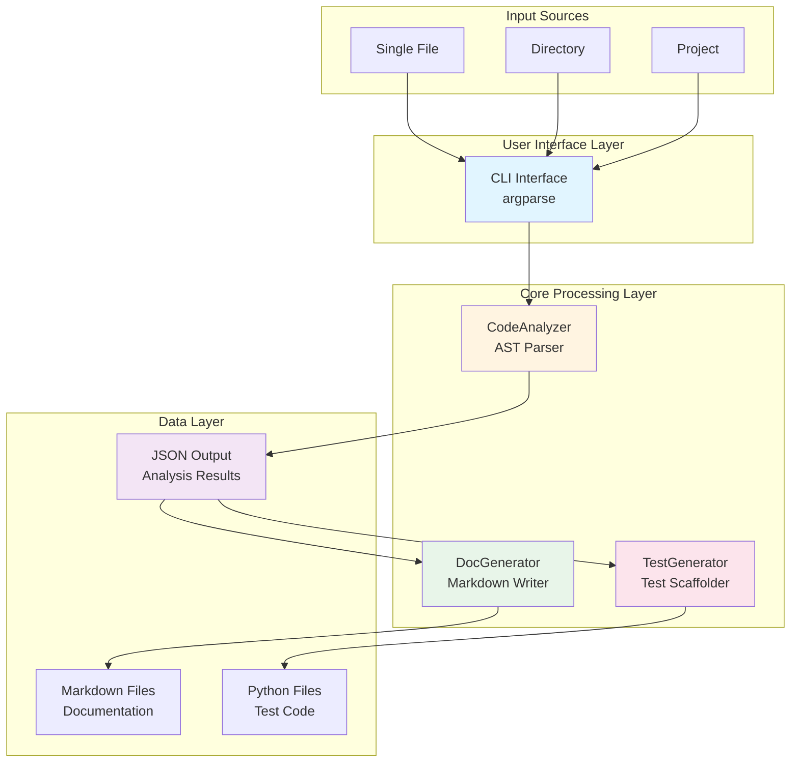
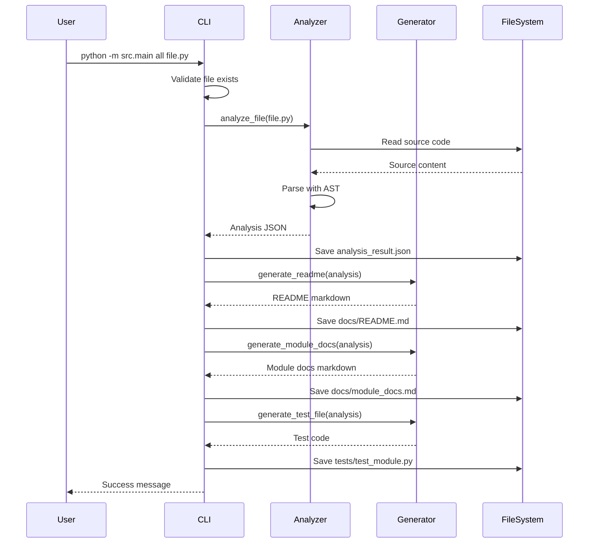
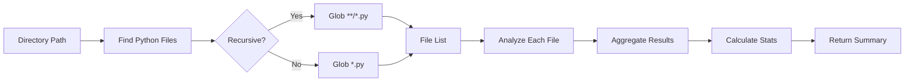

# Developer Workflow Accelerator - Detailed Architecture Plan

## Executive Summary

This document provides a comprehensive architecture plan for the Developer Workflow Accelerator, a Python CLI tool that automates code analysis, documentation generation, and test creation. The system is designed to support three operational modes: single file, directory, and full project analysis.

## Table of Contents

1. [System Architecture Overview](#system-architecture-overview)
2. [Module Specifications](#module-specifications)
3. [Data Flow Architecture](#data-flow-architecture)
4. [File Structure](#file-structure)
5. [Implementation Approach](#implementation-approach)
6. [Configuration & Extensibility](#configuration--extensibility)
7. [Testing Strategy](#testing-strategy)
8. [Deployment & Usage](#deployment--usage)

---

## 1. System Architecture Overview

### 1.1 High-Level Architecture



### 1.2 Design Principles

1. **Modularity**: Each component has a single, well-defined responsibility
2. **Zero Dependencies**: Uses only Python standard library
3. **Extensibility**: Easy to add new generators or analyzers
4. **Error Resilience**: Graceful handling of malformed code
5. **Performance**: Efficient AST traversal and file operations
6. **Type Safety**: Comprehensive type hints throughout

### 1.3 Technology Stack

| Component | Technology | Version | Purpose |
|-----------|-----------|---------|---------|
| Language | Python | 3.10+ | Core implementation |
| Parser | ast module | stdlib | Code analysis |
| CLI | argparse | stdlib | Command interface |
| File I/O | pathlib | stdlib | Path operations |
| Data Format | JSON | stdlib | Structured output |
| Testing | pytest | 7.0+ | Unit testing |
| Type Checking | mypy | 1.0+ | Static analysis |

---

## 2. Module Specifications

### 2.1 CodeAnalyzer Module

**Location:** [`src/analyzer/code_analyzer.py`](../src/analyzer/code_analyzer.py)

**Responsibility:** Parse Python source files and extract structural information using AST

#### Class: `CodeAnalyzer`

**Public Methods:**

```python
class CodeAnalyzer:
    def __init__(self) -> None:
        """Initialize the analyzer."""
        
    def analyze_file(self, file_path: str) -> Dict[str, Any]:
        """Analyze a single Python file.
        
        Returns:
            {
                "file": str,
                "module_docstring": str | None,
                "imports": List[Dict],
                "functions": List[Dict],
                "classes": List[Dict],
                "errors": str | None
            }
        """
        
    def analyze_directory(self, dir_path: str, recursive: bool = True) -> Dict[str, Any]:
        """Analyze all Python files in a directory.
        
        Returns:
            {
                "directory": str,
                "files_analyzed": int,
                "results": Dict[str, Dict]
            }
        """
        
    def get_project_stats(self, dir_results: Dict[str, Any]) -> Dict[str, Any]:
        """Calculate aggregate statistics for a project."""
        
    def save_to_file(self, result: Dict[str, Any], output_path: str) -> None:
        """Save analysis results to JSON file."""
```

**Private Methods:**

```python
def _parse_source(self, source_code: str, file_path: str) -> Dict[str, Any]:
    """Core AST parsing logic."""
    
def _extract_imports(self, tree: ast.AST) -> List[Dict[str, Any]]:
    """Extract import statements."""
    
def _extract_functions(self, tree: ast.AST) -> List[Dict[str, Any]]:
    """Extract module-level functions."""
    
def _extract_classes(self, tree: ast.AST) -> List[Dict[str, Any]]:
    """Extract class definitions."""
    
def _extract_methods(self, class_node: ast.ClassDef) -> List[Dict[str, Any]]:
    """Extract methods from a class."""
    
def _extract_arguments(self, func_node: ast.FunctionDef) -> List[Dict[str, Any]]:
    """Extract function/method arguments."""
    
def _is_method(self, func_node: ast.FunctionDef, tree: ast.AST) -> bool:
    """Determine if function is a class method."""
    
def _error_result(self, error_message: str) -> Dict[str, Any]:
    """Create standardized error result."""
```

**Data Structures:**

```python
# Function/Method Structure
{
    "name": str,
    "line": int,
    "docstring": str | None,
    "args": List[{"name": str, "annotation": str | None}],
    "decorators": List[str],
    "is_async": bool,
    "returns": str | None
}

# Class Structure
{
    "name": str,
    "line": int,
    "docstring": str | None,
    "bases": List[str],
    "methods": List[Dict],
    "decorators": List[str]
}

# Import Structure
{
    "type": "import" | "from_import",
    "module": str,
    "name": str | None,
    "alias": str | None,
    "line": int
}
```

**Key Features:**
- AST-based parsing (safe, no code execution)
- Handles syntax errors gracefully
- Extracts type annotations
- Preserves docstrings
- Identifies decorators (@staticmethod, @classmethod, etc.)
- File size validation (max 10MB)

---

### 2.2 DocGenerator Module

**Location:** [`src/doc_generator/doc_gen.py`](../src/doc_generator/doc_gen.py)

**Responsibility:** Generate professional Markdown documentation from analysis results

#### Class: `DocGenerator`

**Public Methods:**

```python
class DocGenerator:
    def __init__(self) -> None:
        """Initialize with default output directory."""
        self.output_dir = Path("docs")
        
    def generate_readme(self, analysis_data: Dict[str, Any], project_name: str) -> str:
        """Generate README.md with project overview."""
        
    def generate_module_docs(self, analysis_data: Dict[str, Any]) -> str:
        """Generate complete module documentation."""
        
    def generate_function_docs(self, function_data: Dict[str, Any]) -> str:
        """Generate Google-style function documentation."""
        
    def generate_class_docs(self, class_data: Dict[str, Any]) -> str:
        """Generate class documentation with methods."""
        
    def save_documentation(self, content: str, filename: str, output_dir: str | None = None) -> None:
        """Save documentation to file."""
```

**Private Methods:**

```python
def _format_arguments(self, args: List[Dict[str, Any]]) -> str:
    """Format function arguments for display."""
    
def _format_method(self, method_data: Dict[str, Any]) -> str:
    """Format method documentation."""
```

**Documentation Templates:**

```markdown
# README.md Structure
- Project Title
- Module Description
- Table of Contents
- Overview (class/function counts)
- Classes Section
  - Class name and docstring
  - Method count
- Functions Section
  - Function name and docstring
- Installation Instructions
- Usage Examples

# Module Documentation Structure
- Module Header
- Module Docstring
- Imports Section (first 10)
- Classes Section
  - Class header with inheritance
  - Class docstring
  - Methods subsection
    - Method signature with types
    - Method docstring
    - Method type indicators (static, class, async)
- Functions Section
  - Function signature with types
  - Function docstring
  - Arguments list
  - Return type
  - Decorators
```

**Key Features:**
- Google-style docstring format
- GitHub-ready Markdown
- Type hint preservation
- Automatic table of contents
- Method signature formatting
- Decorator documentation

---

### 2.3 TestGenerator Module

**Location:** [`src/test_generator/test_gen.py`](../src/test_generator/test_gen.py)

**Responsibility:** Generate pytest-compatible unit test scaffolding

#### Class: `TestGenerator`

**Public Methods:**

```python
class TestGenerator:
    def __init__(self) -> None:
        """Initialize with default output directory."""
        self.output_dir = Path("tests")
        self.indent = "    "
        
    def generate_test_file(self, analysis_data: Dict[str, Any], module_name: str) -> str:
        """Generate complete test file for a module."""
        
    def generate_class_tests(self, class_data: Dict[str, Any]) -> str:
        """Generate test class for a given class."""
        
    def generate_function_tests(self, function_data: Dict[str, Any]) -> str:
        """Generate tests for a standalone function."""
        
    def generate_conftest(self, analysis_data: Dict[str, Any]) -> str:
        """Generate conftest.py with shared fixtures."""
        
    def save_test_file(self, content: str, filename: str, output_dir: str | None = None) -> None:
        """Save test file with proper naming."""
```

**Private Methods:**

```python
def _generate_method_tests(self, method_data: Dict, class_name: str, class_data: Dict) -> str:
    """Generate tests for a class method."""
    
def _generate_fixtures(self, analysis_data: Dict[str, Any]) -> str:
    """Generate pytest fixtures."""
    
def _generate_sample_args(self, args: List[Dict[str, Any]]) -> str:
    """Generate sample argument values based on types."""
    
def _sanitize_identifier(self, name: str) -> str:
    """Ensure valid Python identifier."""
```

**Test Generation Patterns:**

```python
# Class Test Structure
class TestClassName:
    """Tests for ClassName class."""
    
    def test_initialization(self):
        """Test class can be initialized."""
        obj = ClassName(args)
        assert obj is not None
        assert isinstance(obj, ClassName)
    
    def test_method_name_happy_path(self):
        """Test method with valid inputs."""
        obj = ClassName(args)
        result = obj.method_name(args)
        assert result is not None
    
    def test_method_name_edge_case(self):
        """Test method with edge case inputs."""
        obj = ClassName(args)
        # Smart detection based on method name
        with pytest.raises(Exception):
            obj.method_name(edge_case_args)

# Function Test Structure
def test_function_name_happy_path():
    """Test function with valid inputs."""
    # TODO: Implement test
    pass

def test_function_name_edge_case():
    """Test function with edge case inputs."""
    # TODO: Implement edge case test
    pass

def test_function_name_error_handling():
    """Test function handles errors correctly."""
    with pytest.raises(ValueError):
        function_name(invalid_args)
```

**Smart Detection Features:**

| Pattern | Detection | Generated Test |
|---------|-----------|----------------|
| `divide` in name | Division operation | `pytest.raises(ValueError)` for zero division |
| `load/save/read/write` | File operation | `pytest.raises(Exception)` for missing file |
| `list` in args | List operation | Edge case with empty list |
| Type hints present | Type-aware args | Sample values matching type |

**Key Features:**
- Pytest framework compatibility
- Happy path + edge case + error tests
- Automatic fixture generation
- Type-aware sample arguments
- Smart edge case detection
- TODO markers for manual completion

---

### 2.4 CLI Interface Module

**Location:** [`src/main.py`](../src/main.py)

**Responsibility:** Provide command-line interface for all operations

#### Command Structure

```bash
python -m src.main <command> <arguments>

Commands:
  analyze   - Analyze Python code structure
  document  - Generate documentation
  test      - Generate unit tests
  all       - Run all operations
  stats     - Show project statistics
```

**Command Implementations:**

```python
def analyze_command(filepath: str) -> None:
    """Run code analysis and save JSON output."""
    
def document_command(filepath: str) -> None:
    """Generate README and module documentation."""
    
def test_command(filepath: str) -> None:
    """Generate test file and conftest if needed."""
    
def all_command(filepath: str) -> None:
    """Run analyze, document, and test in sequence."""
    
def stats_command(dirpath: str) -> None:
    """Display project-wide statistics."""
```

**User Experience Features:**
- Clear progress indicators
- File existence validation
- Helpful error messages
- Warning for file overwrites
- Success confirmations
- Next steps guidance

---

## 3. Data Flow Architecture

### 3.1 Single File Analysis Flow



### 3.2 Directory Analysis Flow



### 3.3 Data Transformation Pipeline

```
Python Source Code
        ↓
    [AST Parser]
        ↓
    JSON Structure
        ↓
    ┌───────┴───────┐
    ↓               ↓
[DocGenerator]  [TestGenerator]
    ↓               ↓
Markdown Files  Python Test Files
```

---

## 4. File Structure

### 4.1 Complete Project Layout

```
developer-workflow-accelerator/
│
├── src/                              # Source code
│   ├── __init__.py                   # Package initialization
│   ├── main.py                       # CLI entry point (276 lines)
│   │
│   ├── analyzer/                     # Code analysis module
│   │   ├── __init__.py              # Exports CodeAnalyzer
│   │   └── code_analyzer.py         # AST-based analyzer (387 lines)
│   │
│   ├── doc_generator/               # Documentation generation
│   │   ├── __init__.py              # Exports DocGenerator
│   │   └── doc_gen.py               # Markdown generator (322 lines)
│   │
│   └── test_generator/              # Test generation
│       ├── __init__.py              # Exports TestGenerator
│       └── test_gen.py              # Pytest generator (411 lines)
│
├── tests/                            # Test files
│   ├── __init__.py                  # Test package init
│   ├── conftest.py                  # Shared fixtures
│   ├── test_code_analyzer.py        # Analyzer tests
│   ├── test_doc_gen.py              # DocGen tests
│   └── test_data_manager.py         # Example tests
│
├── examples/                         # Example files
│   ├── README.md                    # Examples documentation
│   ├── sample_calculator.py         # Demo calculator
│   └── data_manager.py              # Demo data manager
│
├── docs/                            # Generated documentation
│   ├── README.md                    # Project README
│   └── *_docs.md                    # Module documentation
│
├── prompts/                         # Project documentation
│   ├── p1.txt                       # Original prompt
│   ├── p2.txt                       # Follow-up prompt
│   ├── problem_solution_statement.md # Problem & solution
│   ├── technology_statement.md      # Technology usage
│   └── architecture_plan.md         # This document
│
├── AGENTS.md                        # AI assistant rules
├── README.md                        # Main project README
├── requirements.txt                 # Dependencies (empty - stdlib only)
├── pyproject.toml                   # Project metadata
├── setup.py                         # Installation script
├── LICENSE                          # MIT License
└── .gitignore                       # Git ignore rules
```

### 4.2 Module Dependencies

```
main.py
  ├── analyzer.CodeAnalyzer
  ├── doc_generator.DocGenerator
  └── test_generator.TestGenerator

CodeAnalyzer
  ├── ast (stdlib)
  ├── json (stdlib)
  └── pathlib (stdlib)

DocGenerator
  └── pathlib (stdlib)

TestGenerator
  ├── re (stdlib)
  └── pathlib (stdlib)
```

**Dependency Graph:**
- No circular dependencies
- Clean separation of concerns
- Each module can be used independently
- CLI orchestrates all modules

---

## 5. Implementation Approach

### 5.1 Development Phases

#### Phase 1: Core Analysis (Completed)
- [x] Implement AST parsing
- [x] Extract functions, classes, methods
- [x] Handle imports and decorators
- [x] Error handling and validation
- [x] JSON output format

#### Phase 2: Documentation Generation (Completed)
- [x] README generation
- [x] Module documentation
- [x] Function/class documentation
- [x] Markdown formatting
- [x] File I/O operations

#### Phase 3: Test Generation (Completed)
- [x] Test file structure
- [x] Class test generation
- [x] Function test generation
- [x] Fixture generation
- [x] Smart edge case detection

#### Phase 4: CLI Interface (Completed)
- [x] Command structure
- [x] Argument parsing
- [x] User feedback
- [x] Error handling
- [x] Multi-command support

#### Phase 5: Testing & Documentation (Completed)
- [x] Unit tests for all modules
- [x] Integration tests
- [x] README documentation
- [x] AGENTS.md for AI assistants
- [x] Example files

### 5.2 Code Quality Standards

**Type Hints:**
```python
# All functions must have type hints
def analyze_file(self, file_path: str) -> Dict[str, Any]:
    """Analyze a Python file."""
    pass
```

**Docstrings:**
```python
# Google-style docstrings required
def method_name(self, param: str) -> int:
    """Brief description.
    
    Args:
        param: Parameter description
        
    Returns:
        Return value description
        
    Example:
        >>> obj.method_name("test")
        42
    """
```

**Error Handling:**
```python
# Use try-except with specific exceptions
try:
    result = operation()
except SpecificError as e:
    return self._error_result(f"Error: {str(e)}")
```

### 5.3 Testing Strategy

**Test Coverage Goals:**
- CodeAnalyzer: 85%+
- DocGenerator: 80%+
- TestGenerator: 75%+
- CLI: 70%+

**Test Types:**
```python
# Happy path tests
def test_analyze_file_success():
    """Test successful file analysis."""
    
# Edge case tests
def test_analyze_file_empty():
    """Test analysis of empty file."""
    
# Error handling tests
def test_analyze_file_not_found():
    """Test error when file doesn't exist."""
```

---

## 6. Configuration & Extensibility

### 6.1 Configuration Options

**Current Configuration:**
```python
# Hard-coded in classes
CodeAnalyzer:
    - max_file_size: 10MB
    
DocGenerator:
    - output_dir: "docs/"
    
TestGenerator:
    - output_dir: "tests/"
    - indent: "    " (4 spaces)
```

**Future Configuration File (config.yaml):**
```yaml
analyzer:
  max_file_size_mb: 10
  skip_private_methods: false
  include_decorators: true

doc_generator:
  output_dir: "docs"
  format: "markdown"  # or "rst", "html"
  include_toc: true
  max_imports_shown: 10

test_generator:
  output_dir: "tests"
  framework: "pytest"  # or "unittest"
  indent_size: 4
  generate_fixtures: true
  smart_detection: true
```

### 6.2 Extension Points

**Custom Analyzers:**
```python
class JavaScriptAnalyzer(BaseAnalyzer):
    """Analyze JavaScript files using esprima."""
    
    def analyze_file(self, file_path: str) -> Dict[str, Any]:
        # Custom implementation
        pass
```

**Custom Generators:**
```python
class HTMLDocGenerator(BaseGenerator):
    """Generate HTML documentation."""
    
    def generate(self, analysis_data: Dict[str, Any]) -> str:
        # Custom implementation
        pass
```

**Plugin System (Future):**
```python
# plugins/custom_analyzer.py
from src.analyzer import BaseAnalyzer

class CustomAnalyzer(BaseAnalyzer):
    name = "custom"
    file_extensions = [".custom"]
    
    def analyze(self, content: str) -> Dict:
        # Implementation
        pass

# Register plugin
register_analyzer(CustomAnalyzer)
```

### 6.3 API for Programmatic Use

```python
# Use as a library
from src.analyzer import CodeAnalyzer
from src.doc_generator import DocGenerator

# Analyze code
analyzer = CodeAnalyzer()
result = analyzer.analyze_file("myfile.py")

# Generate docs
doc_gen = DocGenerator()
readme = doc_gen.generate_readme(result, "MyProject")
doc_gen.save_documentation(readme, "README.md")
```

---

## 7. Testing Strategy

### 7.1 Test Organization

```
tests/
├── conftest.py                 # Shared fixtures
├── test_code_analyzer.py       # Analyzer tests
├── test_doc_gen.py            # DocGen tests
├── test_test_gen.py           # TestGen tests (meta!)
└── integration/               # Integration tests
    └── test_full_workflow.py  # End-to-end tests
```

### 7.2 Test Fixtures

```python
# conftest.py
@pytest.fixture
def sample_python_code():
    """Fixture providing sample Python code."""
    return '''
class Calculator:
    """A simple calculator."""
    
    def add(self, a: int, b: int) -> int:
        """Add two numbers."""
        return a + b
'''

@pytest.fixture
def analyzer():
    """Fixture providing CodeAnalyzer instance."""
    return CodeAnalyzer()
```

### 7.3 Test Coverage

**Run Tests:**
```bash
# Run all tests
pytest tests/ -v

# Run with coverage
pytest tests/ --cov=src --cov-report=html

# Run specific test file
pytest tests/test_code_analyzer.py -v

# Run specific test
pytest tests/test_code_analyzer.py::test_analyze_file -v
```

---

## 8. Deployment & Usage

### 8.1 Installation

```bash
# Clone repository
git clone https://github.com/yourusername/dev-workflow-accelerator.git
cd dev-workflow-accelerator

# No dependencies to install - uses stdlib only!
# Optional: Install dev dependencies
pip install pytest mypy black
```

### 8.2 Usage Examples

**Analyze a single file:**
```bash
python -m src.main analyze examples/sample_calculator.py
# Output: analysis_result.json
```

**Generate documentation:**
```bash
python -m src.main document examples/sample_calculator.py
# Output: docs/README.md, docs/sample_calculator_docs.md
```

**Generate tests:**
```bash
python -m src.main test examples/sample_calculator.py
# Output: tests/test_sample_calculator.py, tests/conftest.py
```

**Run all operations:**
```bash
python -m src.main all examples/sample_calculator.py
# Output: All of the above
```

**Project statistics:**
```bash
python -m src.main stats src/
# Output: Console statistics
```

### 8.3 CI/CD Integration

**GitHub Actions Example:**
```yaml
name: Documentation Update

on:
  push:
    branches: [ main ]
    paths:
      - 'src/**/*.py'

jobs:
  update-docs:
    runs-on: ubuntu-latest
    steps:
      - uses: actions/checkout@v2
      
      - name: Set up Python
        uses: actions/setup-python@v2
        with:
          python-version: '3.10'
      
      - name: Generate Documentation
        run: |
          python -m src.main document src/analyzer/code_analyzer.py
          python -m src.main document src/doc_generator/doc_gen.py
          python -m src.main document src/test_generator/test_gen.py
      
      - name: Commit Documentation
        run: |
          git config --local user.email "action@github.com"
          git config --local user.name "GitHub Action"
          git add docs/
          git commit -m "Auto-update documentation" || echo "No changes"
          git push
```

---

## 9. Future Enhancements

### 9.1 Planned Features (v0.2.0)

1. **Multi-Language Support**
   - JavaScript/TypeScript (using esprima)
   - Java (using javalang)
   - Go (using go/parser)

2. **Enhanced Documentation**
